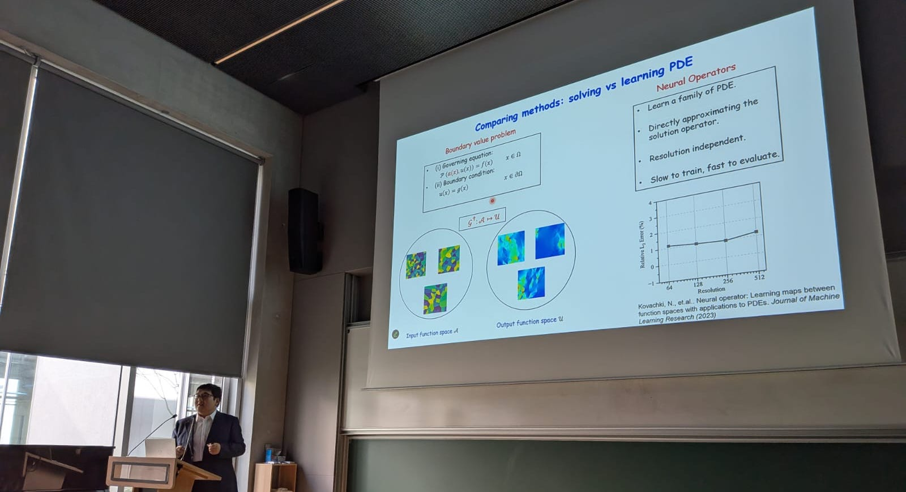

##  &nbsp; Welcome to the Solid Mechanics Laboratory (LMS) seminar series webpage!

This wiki serves as a central hub for the seminar series of the [Laboratoire de Mècanique des Solides/Solid Mechanics Laboratory](https://lms.ip-paris.fr/) (LMS). This series consists of **weekly seminars** by esteemed researchers from across the world in the broad area of mechanics of solids, structures and materials. 

**Organizer:** Vignesh Kannan ([vignesh.kannan@polytechnique.edu](mailto:vignesh.kannan@polytechnique.edu))

### Upcoming seminars

:::: {.talk-card}

### [February 19, 2026] Anne Tanguy (LaMCoS, INSA Lyon/ONERA, U. Paris-Saclay/LMS, Ecole Polytechnique)

**Date and Place:** February 19, 2026 at the Pole Mecanique amphitheatre  
**Title:** A mechanical description of thermal conductivity and its applications

::: {.button}

[<iconify-icon icon="fa-solid:chalkboard" aria-label="announcement"></iconify-icon> Announcement](Resources/lms-seminar-docs/docs/26-01-abstract-announcements/0219-AnneTanguy/01-lms-seminar-external.pdf){.button target="_blank"}

<!-- [<iconify-icon icon="fa-solid:chalkboard" aria-label="slides"></iconify-icon> Recording](https://sdrive.cnrs.fr/s/LspL5itra83aozH){.button target="_blank"} -->

:::

::::

Access the full schedule for the current semester here -> [**Schedule**](Schedule.qmd)

Access the previous seminars and recordings here -> [**Archive**](PastSeminarsArchive.qmd)

  

 
[**Miscellaneous**](AdditionalResources.qmd): Additional information and tools to support your daily scientific activities.