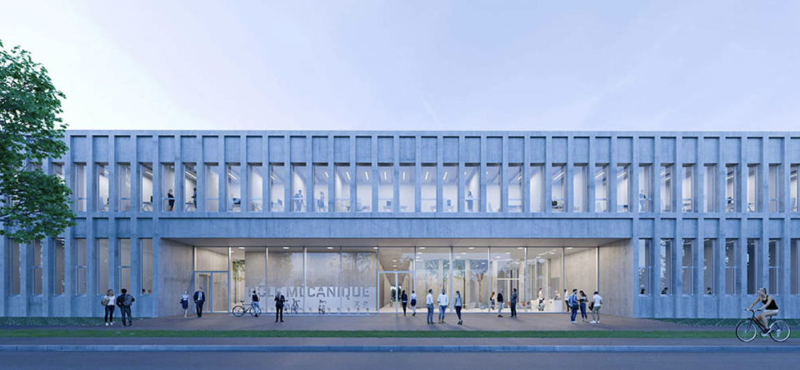

##  &nbsp; Welcome to the Solid Mechanics Laboratory (LMS) seminar series webpage!

This wiki serves as a central hub for the seminar series of the [Laboratoire de Mècanique des Solides/Solid Mechanics Laboratory](https://lms.ip-paris.fr/) (LMS). This series consists of **weekly seminars** by esteemed researchers from across the world in the broad area of mechanics of solids, structures and materials. 

**Organizer:** Vignesh Kannan ([vignesh.kannan@polytechnique.edu](mailto:vignesh.kannan@polytechnique.edu))

Here, you will find:

* [**Schedule**](Schedule.qmd): View the upcoming seminar schedule.
* [**Past Seminars Archive**](PastSeminarsArchive.qmd): Access previous seminar presentations and slide decks.
* [**Invitations**](Invitations.qmd): (For internal memebers only) If you wish to invite a guest, please enter their information here.
* [**Miscellaneous**](AdditionalResources.qmd): Additional information and tools to support your daily scientific activities.

### Upcoming seminars

:::: {.talk-card}

### December 4, 2025: LMS Internal seminar (Architected materials)

**Date and Place:** December 4, 2025 at the Pole Mecanique amphitheatre 
**Title:** Architected materials (Moderator: Kostas Danas)

::: {.button}

[<iconify-icon icon="fa-solid:chalkboard" aria-label="announcement"></iconify-icon> Announcement](){.button target="_blank"}

<!-- [<iconify-icon icon="fa-solid:chalkboard" aria-label="slides"></iconify-icon> Slides](https://sdrive.cnrs.fr/s/Dpy3qaj3A5NggXN){.button target="_blank"} -->

:::

::::