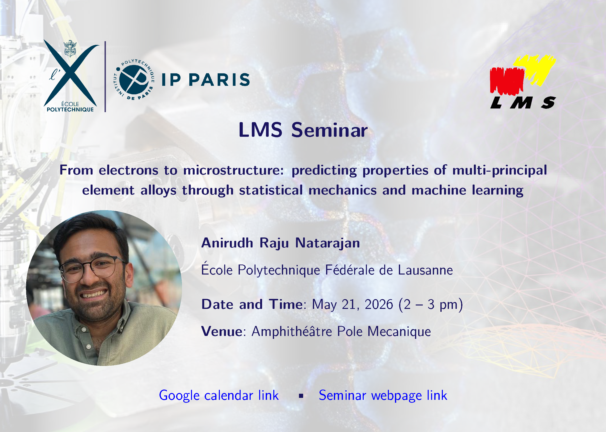

##  &nbsp; Welcome to the Solid Mechanics Laboratory (LMS) seminar series webpage!

This wiki serves as a central hub for the seminar series of the [Laboratoire de Mècanique des Solides/Solid Mechanics Laboratory](https://lms.ip-paris.fr/) (LMS). This series consists of **weekly seminars** by esteemed researchers from across the world in the broad area of mechanics of solids, structures and materials. 

**Organizer:** Vignesh Kannan ([vignesh.kannan@polytechnique.edu](mailto:vignesh.kannan@polytechnique.edu))

### Upcoming seminars

:::: {.talk-card}

### Anirudh Raju Natarajan (EPFL)

**Date and Place:** May 21, 2026 at the Pole Mecanique amphitheatre  
**Title:** From electrons to microstructure: predicting properties of multi-principal element alloys through statistical mechanics and machine learning

::: {.button}

[<iconify-icon icon="fa-solid:chalkboard" aria-label="announcement"></iconify-icon> Abstract & Bio](Resources/lms-seminar-docs/docs/26-01-abstract-announcements/0521-AnirudhNatarajan/01-lms-seminar-external.pdf){.button target="_blank"}

<!-- [<iconify-icon icon="fa-solid:chalkboard" aria-label="slides"></iconify-icon> Recording](https://sdrive.cnrs.fr/s/LspL5itra83aozH){.button target="_blank"} -->

:::

[{fig-align="left" width="60%"}](Resources/lms-seminar-docs/docs/26-01-abstract-announcements/0521-AnirudhNatarajan/02-lms-seminar-external.png)

::::

Access the full schedule for the current semester here -> [**Schedule**](Schedule.qmd)

Access the previous seminars and recordings here -> [**Archive**](PastSeminarsArchive.qmd)

[**Miscellaneous**](AdditionalResources.qmd): Additional information and tools to support your daily scientific activities.mec